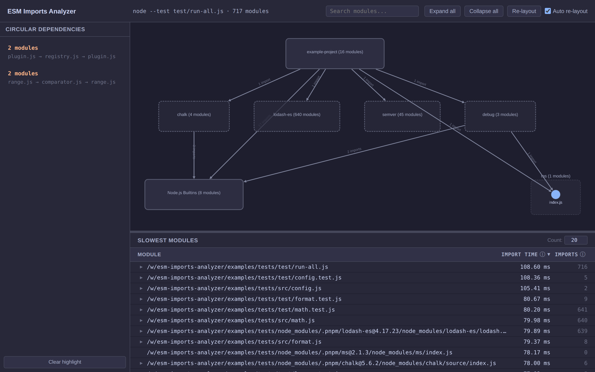

# ESM Imports Analyzer

A CLI tool that captures all ESM imports during a Node.js application's execution and generates a self-contained HTML report with an interactive dependency graph and timing data.



[Live demo](https://alcuadrado.github.io/esm-imports-analyzer/)

## Usage

Requires **Node.js 24+**.

### Install

```bash
npm install -D esm-imports-analyzer
```

### Run

```bash
npx esm-imports-analyzer -- node app.js
```

The `--` separator is required. Everything after it is the command to analyze.

```bash
# Analyze a test suite
npx esm-imports-analyzer -- node --test test/run-all.js

# Analyze a CLI tool
npx esm-imports-analyzer -- node_modules/.bin/tool compile

# Custom output path
npx esm-imports-analyzer -o report.html -- node app.js
```

> **Avoid using `npx`, `pnpm`, `bunx`, etc. after `--`** — they are Node.js processes themselves and will be measured. Use `node_modules/.bin/<tool>` or `node <script>` directly instead.

### Options

```
--output, -o <path>   Output HTML report path (default: ./esm-imports-report.html)
--help, -h            Show help
--version, -v         Show version
```

## Features

The generated report is a single HTML file with:

- **Dependency graph** — interactive visualization of all module imports, grouped by package
- **Import time** — wall-clock time to fully import each module (resolve + load + parse + dependencies + top-level execution)
- **Circular dependency detection** — found via Tarjan's strongly connected components algorithm
- **Package grouping** — modules grouped by `package.json` boundaries with collapsible folder hierarchy
- **Slowest modules table** — sortable by import time or recursive import count
- **Search** — highlight matching modules across the graph

### Graph interactions

| Action                   | Effect                                                                                                                     |
| ------------------------ | -------------------------------------------------------------------------------------------------------------------------- |
| Click a node             | Select it. Highlights outgoing imports (blue), incoming importers (green), and cycle edges (yellow). Everything else dims. |
| Shift-click              | Toggle a node in/out of the selection without affecting other selected nodes.                                              |
| Double-click a package   | Expand or collapse it.                                                                                                     |
| Double-click a folder    | Expand it (show its children inside the package).                                                                          |
| Double-click a module    | Zoom into it.                                                                                                              |
| Double-click empty space | Zoom to fit the entire graph.                                                                                              |
| Right-click any node     | Context menu: expand importer/imported files, copy absolute path, copy full import chain from root.                        |
| Hover a module           | Tooltip with full path and import time.                                                                                    |

### Other UI elements

- **Cycles panel** (left sidebar) — lists all circular dependencies. Click one to reveal and highlight its members with orange.
- **Table** (bottom, resizable) — shows the slowest modules. Click a row to focus on it in the graph. Sortable by import time, import count, or name.
- **Expand all / Collapse all** — buttons in the header.
- **Auto re-layout** — checkbox (default: on). When enabled, the graph layout recomputes automatically after every expand/collapse. Disable it to manually control when layout runs via the Re-layout button. Useful for very large graphs where automatic layout can be slow.

## How it works

1. The CLI prepends `--import=<register.ts>` to `NODE_OPTIONS` and spawns your command as a child process. This injects a loader hook into the Node.js runtime without modifying your code.

2. The loader uses `module.registerHooks()` (Node 24's in-thread hooks API) to intercept every `resolve` and `load` call. On each `resolve`, it records a timestamp. On each `load`, it appends a small callback invocation to the module's source code:

   ```js
   // Your module's source
   import { foo } from "./bar.js";
   doSomething();

   // Injected at the end:
   globalThis.__esm_analyzer_import_done__("<module-url>");
   ```

3. When the module finishes evaluating — after all its static dependencies have been resolved, loaded, and evaluated, and its own top-level code has run — the injected callback fires and records the elapsed time since the resolve hook started. This gives the **total import time**: the full wall-clock cost of importing that module, including everything it triggers.

4. On process exit, all collected data is written to a temporary JSON file.

5. The CLI reads that file and runs the analysis pipeline: builds the import tree, detects cycles (Tarjan's SCC), groups modules by package, computes the folder hierarchy, and ranks modules by import time.

6. The result is assembled into a single self-contained HTML file. The graph is rendered client-side using [Cytoscape.js](https://js.cytoscape.org/) with [dagre](https://github.com/dagrejs/dagre) layout computed in a Web Worker.

## Known limitations

- **Node.js 24+ required** — uses `module.registerHooks()`, available since Node 24.
- **ESM entry point required** — the project being analyzed must use ESM (`"type": "module"` or `.mjs` entry). CJS modules imported from ESM are measured correctly.
- **Modules that throw** — if a module throws during evaluation, the injected callback never runs, so its import time won't be recorded.
- **Top-level await** — import time includes time spent suspended in `await`. This is technically correct (it's real time your app waits) but can make async modules look disproportionately slow.
- **Process must exit cleanly** — import data is flushed via `beforeExit`/`exit` event handlers. If the process is killed with `SIGKILL` or exits in a way that skips these handlers, data may be lost.
- **CDN dependency** — the HTML report loads Cytoscape.js from [unpkg](https://unpkg.com/) on first open. After that, the browser cache handles it.

## License

MIT - Patricio Palladino
